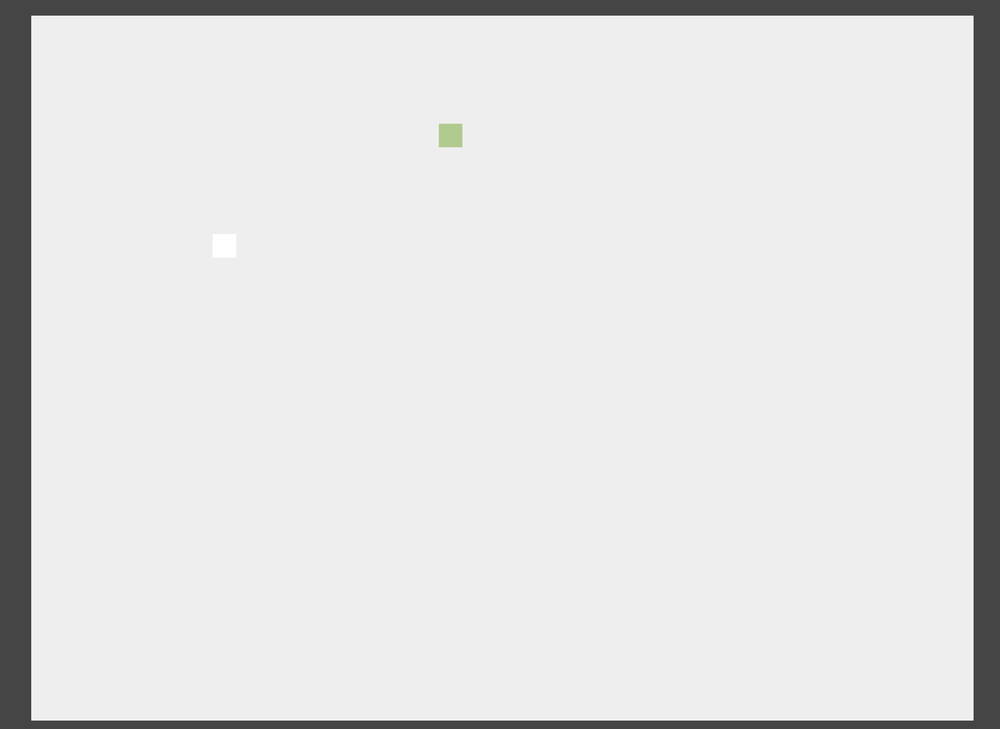

## Spec

Write a minimal JS client application for a minigame of a user commanded dot that should catch a bot-commanded dot over a canvas.

The board is a box of 400 (horizontal) x 300 (vertical). Both user and bot dots have size of 10x10.

The client app should connect through websocket to the endpoint at `/game`
using socket.io (`https://cdnjs.cloudflare.com/ajax/libs/socket.io/0.9.16/socket.io.min.js`).

## Server interface description

The events that can be emited to the server through the socket are:

- `pause`, that will switch between game paused and running on the server
- `move`, to inform the server of an user movement. The json payload to be sent is in the form `{'x': x, 'y': y}`, where both `x` and `y` shoud be either `0`, `1` or `-1`.
     - `x` indicates horizontal movement, with `-1` a step to the left, `0` no movement, and `1` a step to the right.
     - `y` indicates vertical movement, with `-1` a step to the top, `0` no movement, and `1` a step to the bottom.

The events that can be sent by the server, and that the client should listen to are:

- `connect`, that is the confirmation of the connection to the server
- `init`, that retrieves the initial state for the game, represented by the initial position of the user in the board as a payload `{'coordx': x, 'coordy': y}`
- `botmove`, that retrieves the current position of the bot in the board as a payload `{'coordx': x, 'coordy': y}`
- `usermove`, that retrieves the current position of the user in the board as a payload `{'coordx': x, 'coordy': y}`
- `collision`, that informs that user and bot have collided, with the posiiton at which the collision happened as payload `{'coordx': x, 'coordy': y}`
- `disconnect` informs that the client has disconnected from the server
- `pause` informs to the client that the game has been paused. This happens after the user has sent the event `pause` and the game state was running.
- `resume` informs to the client that the game has been resumed. This happens after the user has sent the event `pause` and the game state was paused.

Server will generate a position for user and bot each 20 milliseconds.
Movements for the bot will be generated by the server.

The position for the user will be calculated based on the `move` event passed by the client for that time slot. If no `move` has been sent, then user will remain static.

Whenever a collision is produced, the server will stop sending bot and user coordinates for 2 seconds. After that, the bot will be generated at a new random position and the persuit will begin again.

## Requirements

The javascript client needs to be compo

After the client connects to the server, the game state will be `paused`, so the client needs to send a `pause` event in order to start.

- You should create a javascript that will draw a html5 canvas on the div with id `mapcanvas`.
Note that the div has height `300` and width `400`, which is the resolution of the canvas (not the size). You can style the div to have any size you want.

- You must render the canvas every 20 milliseconds (that is the frequency with which server sends user and bot positions.

- As this is an interactive application, you need to capture player's keypress in order to detect the move the client needs to send. (It's suggested to move the player's character using the arrow keys, and the spacebar being the `pause`). You need to send this captured movements also every 20 milliseconds so the server can reflect the user movement on each time span.

For all cases, the x and y coords are for the center of the user / bot box. You need to consider that in order to draw them, so what is rendered is consistent with the collisions detected by the server.

You can, as an extra, draw messages whenever a collision occurs (i.e. when the user has catched the bot); keep a count of catches; or other thing you think it would be nice to show in the user interface.

